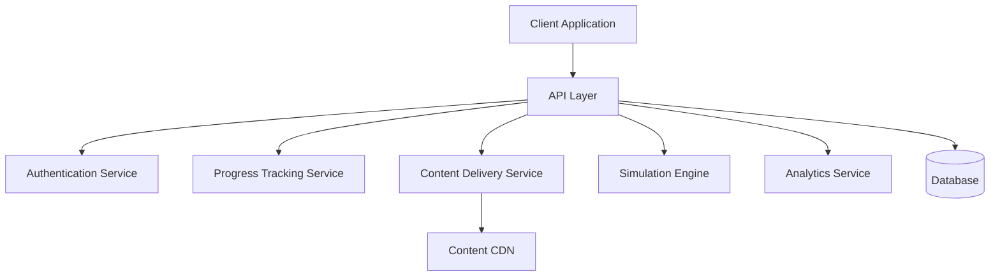

# Design Document: Cybercrime Training Platform

## Overview

The Cybercrime Training Platform is a web-based gamified application designed to train police officers in cybercrime investigation procedures aligned with Indian systems like NCRP, CCTNS, and the 1930 helpline protocols. The platform employs interactive simulations, progression-based modules, and gamification elements to create an engaging learning experience that effectively trains officers in practical cybercrime investigation skills.

This design document outlines the technical architecture, components, data models, and implementation strategies for the platform. The design prioritizes accessibility across devices, performance in low-bandwidth environments, and a compelling user experience that reinforces learning objectives.

## Architecture

### High-Level Architecture

The platform will follow a modern web application architecture with the following key components:



### Technology Stack

1. **Frontend**:
   - React.js for the user interface
   - Redux for state management
   - TailwindCSS for responsive design
   - HTML5 Canvas/WebGL for interactive simulations
   - Progressive Web App (PWA) capabilities for offline access

2. **Backend**:
   - Node.js with Express for the API layer
   - MongoDB for the database (flexible schema for module content and user progress)
   - Redis for caching and session management
   - JWT for authentication

3. **Infrastructure**:
   - Containerized deployment with Docker
   - CDN for static assets and media content
   - Compression and lazy loading for low-bandwidth optimization

## Components and Interfaces

### 1. User Authentication and Profile System

**Components**:
- Registration and login forms
- Profile management interface
- Role-based access control (Admin, Trainer, Trainee)
- Password reset and account recovery

**Interfaces**:
```typescript
interface User {
  id: string;
  name: string;
  email: string;
  role: 'admin' | 'trainer' | 'trainee';
  department: string;
  badgesEarned: Badge[];
  moduleProgress: ModuleProgress[];
  createdAt: Date;
  lastLogin: Date;
}

interface Badge {
  id: string;
  name: string;
  description: string;
  imageUrl: string;
  earnedAt: Date;
}
```

### 2. Module Management System

**Components**:
- Module content editor (admin interface)
- Module sequencing and prerequisites
- Content versioning and publishing workflow
- Media asset management

**Interfaces**:
```typescript
interface Module {
  id: string;
  title: string;
  description: string;
  objectives: string[];
  prerequisites: string[]; // IDs of prerequisite modules
  activities: Activity[];
  badgeReward: Badge;
  minPassingScore: number;
  estimatedDuration: number; // in minutes
  version: string;
  isPublished: boolean;
}

interface Activity {
  id: string;
  type: 'quiz' | 'simulation' | 'roleplay' | 'dragdrop' | 'interactive';
  title: string;
  content: any; // Structured based on activity type
  points: number;
  timeLimit?: number; // in seconds, if applicable
}
```

### 3. Simulation Engine

**Components**:
- Interactive scenario renderer
- Dialog system for victim interactions
- Form simulation for NCRP/CCTNS interfaces
- Timer-based challenge system
- Decision tree processing for branching scenarios

**Interfaces**:
```typescript
interface Simulation {
  id: string;
  type: 'dialog' | 'form' | 'map' | 'decision' | 'timer';
  scenario: Scenario;
  interactions: Interaction[];
  outcomes: Outcome[];
  assets: Asset[];
}

interface Scenario {
  id: string;
  title: string;
  description: string;
  context: string;
  characters?: Character[];
}

interface Interaction {
  id: string;
  type: string;
  prompt: string;
  options?: InteractionOption[];
  correctResponse?: any;
  timeLimit?: number;
}

interface Outcome {
  id: string;
  condition: string; // JavaScript condition to evaluate
  feedback: string;
  points: number;
  nextInteractionId?: string;
}
```

### 4. Progress Tracking System

**Components**:
- XP and scoring algorithms
- Module unlocking logic
- Performance analytics dashboard
- Weak area identification
- Certification generation

**Interfaces**:
```typescript
interface ModuleProgress {
  userId: string;
  moduleId: string;
  status: 'not_started' | 'in_progress' | 'completed' | 'failed';
  activitiesCompleted: ActivityProgress[];
  currentScore: number;
  attempts: number;
  startedAt: Date;
  completedAt?: Date;
  timeSpent: number; // in seconds
}

interface ActivityProgress {
  activityId: string;
  status: 'not_started' | 'in_progress' | 'completed';
  score: number;
  attempts: number;
  userResponses: any[];
}

interface Certificate {
  id: string;
  userId: string;
  issueDate: Date;
  expiryDate?: Date;
  modules: string[]; // IDs of completed modules
  overallScore: number;
  verificationCode: string;
}
```

### 5. Admin and Analytics Dashboard

**Components**:
- User management interface
- Content management system
- Performance analytics visualization
- Batch progress tracking
- Report generation

**Interfaces**:
```typescript
interface AnalyticsData {
  userId?: string;
  moduleId?: string;
  metricType: 'completion_rate' | 'avg_score' | 'time_spent' | 'error_rate';
  value: number;
  dimension: 'daily' | 'weekly' | 'monthly';
  timestamp: Date;
}

interface Report {
  id: string;
  type: 'user' | 'module' | 'batch' | 'department';
  targetId: string;
  metrics: ReportMetric[];
  generatedAt: Date;
  format: 'pdf' | 'csv' | 'json';
}
```

## Data Models

### Core Data Models

#### User Model
- Basic profile information
- Authentication credentials
- Role and permissions
- Department and jurisdiction
- Training progress and achievements

#### Module Model
- Module metadata and structure
- Activities and content
- Scoring rules and badge criteria
- Prerequisites and sequencing

#### Activity Model
- Activity type and configuration
- Content and media assets
- Interaction rules and scoring logic
- Feedback and outcomes

#### Progress Model
- User activity tracking
- Scores and completion status
- Time spent and attempts
- Performance metrics

#### Certificate Model
- Certification details
- Verification information
- Linked modules and achievements
- Expiry and renewal information

### Database Schema

The platform will use MongoDB as the primary database, with the following collections:

1. `users` - User profiles and authentication data
2. `modules` - Training module definitions
3. `activities` - Activity configurations and content
4. `progress` - User progress and performance data
5. `badges` - Badge definitions and criteria
6. `certificates` - Generated certificates and verification data
7. `analytics` - Usage and performance metrics
8. `media` - References to media assets (stored in CDN)

## Error Handling

### Error Categories

1. **Authentication Errors**
   - Invalid credentials
   - Session expiration
   - Unauthorized access

2. **Content Errors**
   - Missing or corrupted module content
   - Media asset loading failures
   - Version mismatches

3. **Simulation Errors**
   - Interaction processing failures
   - Timer synchronization issues
   - State management errors

4. **Network Errors**
   - Connection loss during activities
   - Synchronization failures
   - Timeout issues

### Error Handling Strategy

1. **Graceful Degradation**
   - Progressive enhancement for low-bandwidth scenarios
   - Offline mode for content already downloaded
   - Simplified fallback interfaces for complex interactions

2. **Error Recovery**
   - Automatic progress saving at key interaction points
   - Session recovery after connection loss
   - Activity state preservation

3. **User Feedback**
   - Clear error messages with actionable steps
   - Visual indicators for system status
   - Help resources for common issues

4. **Logging and Monitoring**
   - Detailed client-side error logging
   - Server-side error aggregation
   - Performance monitoring for slow interactions

## Testing Strategy

### Testing Levels

1. **Unit Testing**
   - Component-level tests for UI elements
   - Service function tests for business logic
   - Data model validation tests

2. **Integration Testing**
   - API endpoint testing
   - Service interaction testing
   - Database operation testing

3. **End-to-End Testing**
   - Complete module completion flows
   - Cross-device functionality testing
   - Authentication and authorization flows

4. **Performance Testing**
   - Load testing for concurrent users
   - Bandwidth limitation simulations
   - Response time benchmarking

### Testing Tools and Frameworks

1. **Frontend Testing**
   - Jest for unit testing
   - React Testing Library for component testing
   - Cypress for end-to-end testing

2. **Backend Testing**
   - Mocha/Chai for API testing
   - Supertest for HTTP assertions
   - MongoDB Memory Server for database testing

3. **Performance Testing**
   - Lighthouse for performance metrics
   - JMeter for load testing
   - Chrome DevTools for network throttling tests

### Accessibility Testing

1. **Standards Compliance**
   - WCAG 2.1 AA compliance testing
   - Mobile accessibility guidelines
   - Keyboard navigation testing

2. **Assistive Technology**
   - Screen reader compatibility
   - Color contrast and text sizing
   - Input method alternatives

## Security Considerations

### Data Protection

1. **User Data Security**
   - Encryption of personal information
   - Secure credential storage (bcrypt)
   - Data minimization principles

2. **Content Security**
   - Access control for training materials
   - Prevention of unauthorized content extraction
   - Secure media asset delivery

### Authentication and Authorization

1. **Authentication Methods**
   - JWT-based authentication
   - Session timeout and renewal
   - Multi-factor authentication option

2. **Authorization Controls**
   - Role-based access control
   - Feature-level permissions
   - Content access restrictions

### API Security

1. **Request Validation**
   - Input sanitization
   - Request rate limiting
   - CSRF protection

2. **Response Security**
   - Data leakage prevention
   - Appropriate error responses
   - Security headers implementation

## Deployment and DevOps

### Deployment Strategy

1. **Environment Configuration**
   - Development, staging, and production environments
   - Configuration management via environment variables
   - Feature flags for gradual rollout

2. **Containerization**
   - Docker containers for consistent deployment
   - Orchestration with Kubernetes or similar
   - Scalability for varying load

### Continuous Integration/Continuous Deployment

1. **Build Pipeline**
   - Automated testing on commit
   - Code quality and security scanning
   - Build artifact generation

2. **Deployment Pipeline**
   - Blue-green deployment strategy
   - Automated rollback capability
   - Deployment verification tests

### Monitoring and Maintenance

1. **Application Monitoring**
   - Error rate tracking
   - Performance metrics collection
   - User experience monitoring

2. **Infrastructure Monitoring**
   - Server health checks
   - Database performance monitoring
   - CDN and network monitoring

## Mobile Optimization

### Responsive Design

1. **Adaptive Layouts**
   - Fluid grid system
   - Breakpoint-based component rendering
   - Touch-friendly interaction targets

2. **Media Optimization**
   - Responsive images and videos
   - Lazy loading for media assets
   - Reduced animation on mobile devices

### Low-Bandwidth Considerations

1. **Content Delivery**
   - Progressive loading of module content
   - Text-first loading strategy
   - Compressed assets and minified code

2. **Offline Capabilities**
   - Service worker for offline access
   - Local storage for progress data
   - Background synchronization when online

## Gamification Elements

### Badge System

1. **Badge Design**
   - Visual badge hierarchy
   - Achievement criteria definition
   - Badge display and showcase

2. **XP and Leveling**
   - Point accumulation algorithm
   - Level progression thresholds
   - Performance-based bonuses

### Progress Visualization

1. **Progress Indicators**
   - Module completion tracking
   - Skill development visualization
   - Comparative performance metrics

2. **Leaderboards and Social Elements**
   - Optional peer comparison
   - Department-level achievements
   - Collaborative challenges

## Accessibility Features

### Visual Accessibility

1. **Color and Contrast**
   - High contrast mode option
   - Colorblind-friendly palette
   - Text size adjustment controls

2. **Screen Reader Support**
   - ARIA attributes implementation
   - Semantic HTML structure
   - Alternative text for visual elements

### Input Accessibility

1. **Keyboard Navigation**
   - Full keyboard control support
   - Focus management
   - Shortcut keys for common actions

2. **Input Alternatives**
   - Voice input support where applicable
   - Alternative input device compatibility
   - Adjustable timing for timed activities